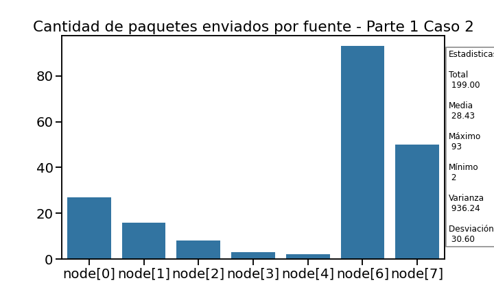

# Informe

## Presentacion

### Objetivos del proyecto

● Leer, comprender y generar modelos de red en Omnet++.
● Analizar tráfico de red bajo diferentes estrategias de enrutamiento.
● Diseñar y proponer soluciones de enrutamiento bajo diferentes topologías.

### Resumen

En este trabajo analizaremos el rol de la capa de red, que deberá decidir por qué interface enviar los paquetes que le llegan ya sea desde la capa de aplicación superior o desde las capas de enlaces inferiores.
No enfrentaremos a el problema de enrutar el tráfico que confluye desde los módulos por múltiples entradas y salidas, utilizando un algoritmo simple (dado por la catedra) y otro mas complejo con el fin de comparar sus diferentes efectos.
Para ello tomaremos estadisticas y probaremos diferentes casos con ambos algoritmos de enrutamiento para ver su influencia utilizando la herramienta de simulación de eventos discretos Omnet++, bajo el lenguaje c++.
<!-- ## Estructura  OPTIONAL: Explicar como se estructurara el informe brevemente
<!-- Presentar brevemente la estructura del informe. Dar algunos detalles mas del proyecto.
Introducir que vamos a dividir el informe en dos partes y que luego las compararemos. 
-->
## Introduccion
<!--
Describir el estado del arte. (trabajos previos) ..."
-->
<!--
- Metodología de trabajo.
-->
### Generalidades

<!-- Agregar definiciones generales, teoria para ya dar por sentada en ambas partes. -->
#### Topologia de red y Estructura interna de los nodos

La red consta de 8 nodos conectados en forma de anillo, cada uno con dos interfaces de comunicación full-duplex con dos posibles vecinos.

Internamente, cada nodo cuenta con dos capas de enlace (link o lnk, una con cada vecino),
una capa de red (net) y una capa de aplicación (app). La capa de aplicación y la capa de enlace implementan generadores de tráfico y buffers respectivamente.

{width=500 height=auto}

### Problematicas
<!--
- Definir el problema y contextualizar al lector con definiciones básicas.
  + "Nosotros en las redes vamos a encontrar tal y tal problema ..."
-->
### Casos de estudio
<!--
- Presentación de nuestros casos de estudio.
   + Explicar caso 1: su ventaja, problemas, que esperamos ver, etc.
   + Explicar caso 2: su ventaja, problemas, que esperamos ver, etc.
-->
1. Nodos (0,2) generan tráfico hacia el node[5] con packetByteSize e interArrivalTime idénticos entre ambos nodos.
2. Nodos (0,1,2,3,4,6,7) generan tráfico hacia el node[5] con packetByteSize e interArrivalTime idénticos entre todos los nodos.

## Parte 1

### Metodos

#### Algoritmo de enrutamiento
<!--
- Describimos el algoritmo.
-->
Cada paquete que recibe un nodo enrutador es evaluado para determinar si el nodo local es el destino final del mismo. En caso de que lo sea, el paquete es enviado a la capa de aplicación local. En caso de que el paquete esté destinado a otro nodo, la capa de red se encarga de re-transmitirlo por la interface número 0 (toLn [0]) que es la que envía el tráfico en sentido de las manecillas del reloj a lo largo del anillo hasta llegar al destino.

<!--
#### Hipótesis
QUESTION: va una hip en esta parte? 
- Una pequeña hipótesis de porque creemos que va a funcionar.
-->
### Resultados
<!-- Graficos y analisis de los mismos 
estudiar las métricas tomadas. ¿Qué métricas se obtienen? ¿Cómo es el uso de los recursos de la red? ¿Se puede mejorar?
En el caso 2 explore y determine a partir de qué valor de interArrivalTime se puede garantizar un equilibrio o estabilidad en la red. Justifique.
-->
#### Caso 1

En este caso, los nodos (0,2) generan tráfico hacia el node[5] con packetByteSize e interArrivalTime idénticos entre ambos.

Nuestro algoritmo siempre enruta los paquetes por la salida en direccion de las manecillas del reloj.
Por lo tanto seguiran estos caminos:
> Node 2 (gen) --> Node 1 --> Node 0 (gen) --> Node 7 --> Node 6 --> Node 5 (sink)

{width=500 height=auto}

>**Tipos de nodos** 
*No utilizados:* No reciben paquetes de su app ni de ningun vecino.
*Generador:* Recibe paquetes de su app y los transmite.
*Conector:* Recibe y retransmite paquetes de algun vecino.
*Destino:* Recibe y consume (manda a su app) paquetes de algun vecino.

Como vemos en la imagen, podemos dividir los efectos en los buffers por cada tipo de nodo:

Los nodos que no transmiten ni re-transmiten paquetes no utilizan su buffer. Esto lo podemos ver en los nodos *No utilizados* 3 y 4 y en el *Destino* 5.

Los nodos *Conectores* no *Generadores* 1, 7 y 6 almacenan en su buffer entre 1 y 0 paquetes.

Los nodos *Generadores* tienen una mayor utilizacion del buffer con una intrinceca variacion debida a los envios no constantes de su app.

El nodo *Generador* que a su vez es *Conector*, al recibir paquetes de su app y de otro nodo mas; de su app recibira los paquetes variablemente, y del nodo que contantemente estara enviando, recibira los paquetes en tiempo contante. Debido a la mayor carga contante que recibe el nodo podemos ver como cumo su buffer tiene una clara tendencia al alza.

Luego, podemos notar en la siguiente grafica que al destino (app nodo 5) llegan paquetes de ambos nodos pero con una diferencia, llagan mas del nodo 0.

{width=500 height=auto}

 Esto se debe al hecho de estar el nodo 0 mas cerca del destino y en el camino entre el nodo 2 y 5. Esto hace que primero lleguen los paquetes del nodo 0 al inicio del programa, de ahi la diferencia.

 No hay otra razon y a lo largo del tiempo deberian llagar una cantidad similar de paquetes al nodo 5 de ambos origenes.
 Esto lo podemos ver en la siguiente grafica donde ademas del delay, podemos ver el orden de llegada por fuente.

{width=500 height=auto}

En este grafico podemos notar dos cosas:

- *Al inicio llegan mas paquetes del node 0*: Esto coicide con lo dicho antes del grafico.
- *El delay va aumentando*: Esto esta directamente relacionado por el aumento lineal del buffer 0 ya que al haber cada vez mas paquetes en cola, cada vez tardaran mas tiempo en llegar.

Luego, otro grafico interedante de ver es el siguiente:

{width=500 height=auto}

En este grafico podemos notar mejor la diferencia entre la distancia que recorrieron los paquetes de cada origen. Como hemos dicho anteriormente, el nodo 0 esta mas cerca y de ahi la menor distancia.

#### Caso 2

<!-- 2. Nodos (0,1,2,3,4,6,7) generan tráfico hacia el node[5] con packetByteSize e interArrivalTime idénticos entre todos los nodos. -->

{width=500 height=auto}

{width=500 height=auto}

{width=500 height=auto}

{width=500 height=auto}

## Parte 2

### Metodos

#### Algoritmo de enrutamiento
<!--
- Describimos el algoritmo.
-->
#### Como llegamos a esa idea
<!-- Como llegamos a esa idea. -->
#### Hipótesis de porque creemos que va a funcionar
<!--
- Una pequeña hipótesis de porque creemos que va a funcionar.
-->
### Resultados
<!-- Graficos y analisis de los mismos 
estudiar las métricas tomadas. ¿Qué métricas se obtienen? ¿Cómo es el uso de los recursos de la red? ¿Se puede mejorar?
¿Hay loops de enrutamiento? Más allá de lo que llegó
a implementar en el simulador, ¿Ve alguna manera de mejorar más aún su diseño?
En el caso 2 explore y determine a partir de qué valor de interArrivalTime se puede garantizar un equilibrio o estabilidad en la red. Justifique.
-->

#### Caso 1

#### Caso 2

## Comparacion de resultados
<!-- Comparar graficos de ambas partes. solo poner los graficos si hay algo que comparar o recordar. 
Evalúe y compare su estrategia con los casos 1 y 2 de la tarea de análisis . ¿Cuánto4
mejoran las métricas? ¿Por qué?
-->
## Discusiones
<!-- cualquier cosa que no entre en la comparacion de resultados va aca, ej: posibles mejoras, obs,conclusiones, ... -->
## Referencias
<!--
- Todas las referencias que usamos en el trabajo. LIBROS, PAPERS, WEB, ETC.
(Nosotros usamos el manual de Omnet++ y quizás algo más ...).
Si agregamos imágenes de Tanembaun para explicar algo, también se debe referenciar.
-->
- Andrew S. Tanenbaum, David J. Wetherall, Redes de Computadoras (5ta edición 2011), Pearson.
- Omnet++ Simulation Manual, (OMNeT++ version 6.0.3, 2020).
