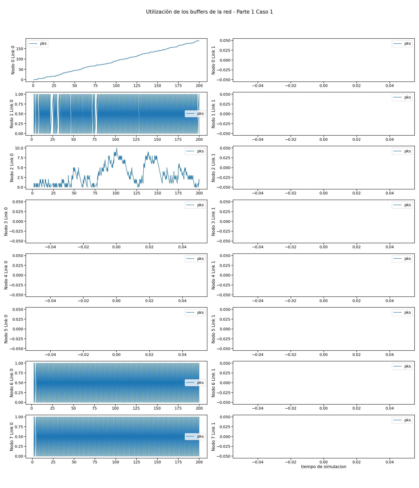
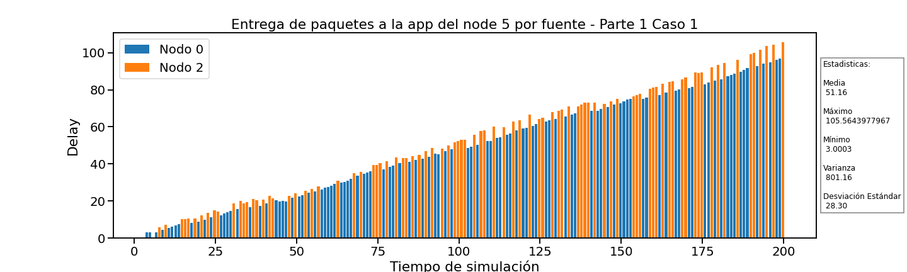
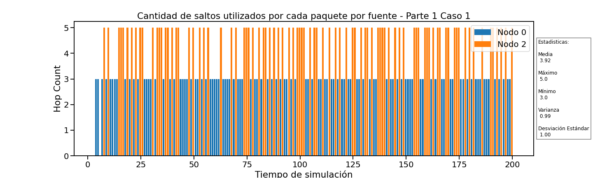
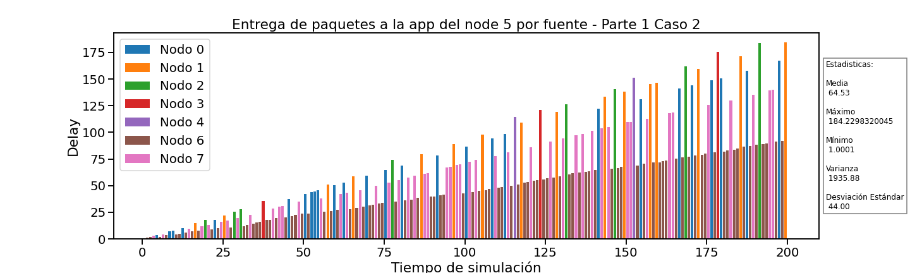
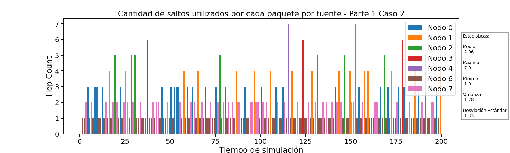
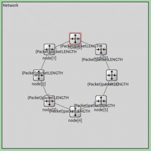
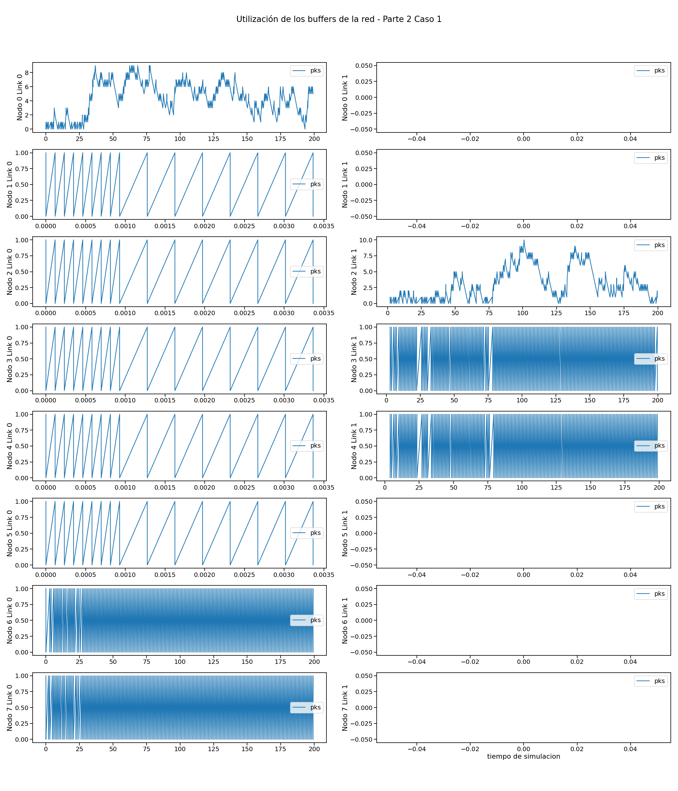
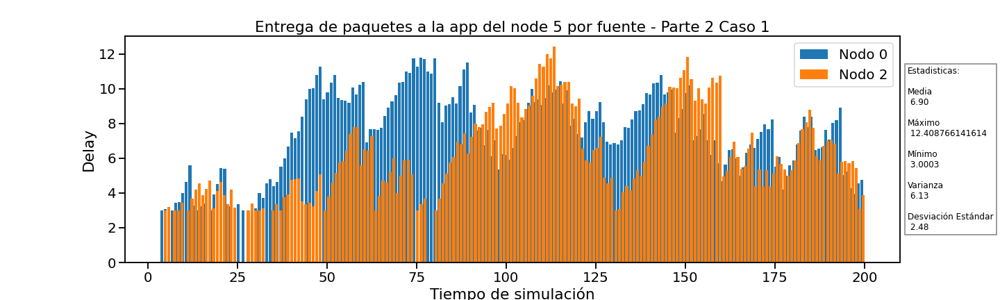
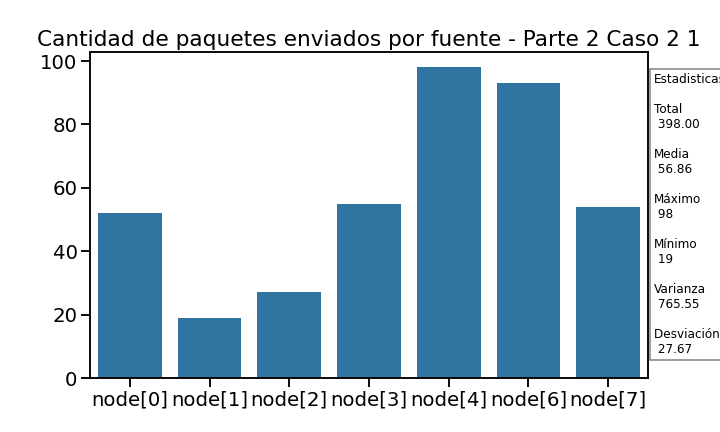
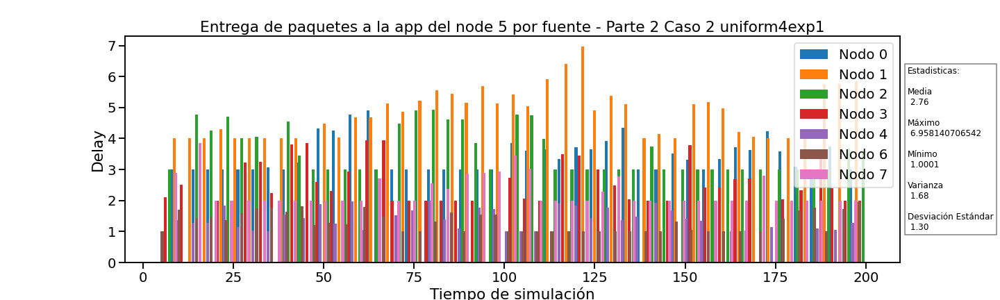

# Análisis del enrutamiento en redes utilizando simulación de eventos discretos y un protocolo diseñado por nosotros

## Presentación

### Objetivos del proyecto

● Leer, comprender y generar modelos de red en Omnet++.
● Analizar tráfico de red bajo diferentes estrategias de enrutamiento.
● Diseñar y proponer soluciones de enrutamiento bajo diferentes topologías.

### Resumen del trabajo

En este trabajo analizaremos el rol de la capa de red, que deberá decidir por qué interface enviar los paquetes que le llegan ya sea desde la capa de aplicación superior o desde las capas de enlaces inferiores.
Nos enfrentaremos a el problema de enrutar el tráfico que confluye desde los módulos por múltiples entradas y salidas, utilizando un algoritmo simple (dado por la cátedra) y otro más complejo con el fin de comparar sus diferentes efectos.
Para ello tomaremos estadísticas y probaremos diferentes casos con ambos algoritmos de enrutamiento para ver su influencia utilizando la herramienta de simulación de eventos discretos Omnet++, bajo el lenguaje c++.

## Estructura del informe

<!-- Explicar como se estructurara el informe brevemente -->
<!-- Presentar brevemente la estructura del informe. Dar algunos detalles más del proyecto.
Introducir que vamos a dividir el informe en dos partes y que luego las compararemos.
-->

El informe se divide en dos partes, en la **primera parte** se estudiará el algoritmo de enrutamiento dado por la cátedra y en la **segunda parte** se estudiará un algoritmo de enrutamiento propuesto por nosotros. En cada parte se estudiarán **dos casos diferentes**.

Hemos tomado los siguientes datos para estudiar el efecto de los diferentes algoritmos de enrutamiento en los casos propuestos:

- Utilización de los buffers de la red (Buffer Size)
- Entrega de paquetes a la app del node 5 por origen (Delay y Source)
- Paquetes llegados a node 5 app por origen (Source)
- Cantidad de saltos utilizados por cada paquete por origen (hopCount y Source)

Finalmente, se compararán los resultados obtenidos en ambas partes y se sacarán conclusiones.

---

## Introducción

### Generalidades y definiciones

<!-- Agregar definiciones generales, teoría para ya dar por sentada en ambas partes. -->

A lo largo del informe utilizaremos los siguientes términos para referirnos a cosas relacionadas **con los nodos**:

- **App:** Capa de aplicación de un nodo que genera paquetes.
- **Buffers:** Espacio de almacenamiento temporal en un nodo.
- **Interfaz:** Conexión entre dos nodos.

También mencionamos los siguientes conceptos relacionados **con la red**:

- **Enrutamiento:** Proceso de seleccionar un camino en una red a través del cual se enviarán los paquetes.
- **Salto:** Un salto es el paso de un paquete de un nodo a otro.
- **Cantidad de saltos:** Cantidad de saltos que realiza un paquete desde su origen hasta su destino.
- **Caminos más cortos:** Rutas que minimizan la cantidad de saltos entre dos nodos.
- **Topología de red:** Estructura de la red que define cómo están conectados los nodos.

#### Topología de red y Estructura interna de los nodos

La red consta de 8 nodos conectados en forma de anillo, cada uno con dos interfaces de comunicación full-duplex con dos posibles vecinos.

Internamente, cada nodo cuenta con dos capas de enlace (link o lnk, una con cada vecino), una capa de red (net) y una capa de aplicación (app). La capa de aplicación y la capa de enlace implementan generadores de tráfico y buffers respectivamente.

La app genera el trafico según los siguientes parámetros:

- _interArrivalTime_: Velocidad con la que se generan los paquetes desde la app del nodo.
- _packetByteSize_: Tamaño de los paquetes de datos generados desde la app.

{width=500 height=auto}

#### Problemáticas

<!--
- Definir el problema.
  + "Nosotros en las redes vamos a encontrar tal y tal problema ..."
-->

Nosotros en la capa de red, en el enrutamiento de los paquetes nos enfrentamos al problema de maximizar la eficiencia con la que llegan a su destino. Para conseguir esto hay muchas estrategias, cada una más apta dependiendo la topología y cantidad de interfaces por nodo, y nuestro objetivo es encontrar la más apta en nuestro caso consiguiendo una eficiencia aceptable.

#### Casos de estudio

- _Caso 1:_ Nodos (0,2) generan tráfico hacia el node[5] con packetByteSize e interArrivalTime idénticos entre ambos nodos.
- _Caso 2:_ Nodos (0,1,2,3,4,6,7) generan tráfico hacia el node[5] con packetByteSize e interArrivalTime idénticos entre todos los nodos.

En ambos casos de estudio:

- _interArrivalTime_ = `exponential(1)`
- _packetByteSize_ = `125000`

#### Tipos de nodos en un flujo de datos

- _No utilizados:_ No reciben paquetes de su app ni de ningún vecino.
- _Generador:_ Recibe paquetes de su app y los transmite.
- _Conector:_ Recibe y retransmite paquetes de algún vecino.
- _Consumidor:_ Recibe y consume (manda a su app) paquetes de algún vecino.

---

## Parte 1

### Métodos

#### Algoritmo de enrutamiento

<!--
- Describimos el algoritmo.
-->

Cada paquete que recibe un nodo enrutador es evaluado para determinar si el nodo local es el destino final del mismo. En caso de que lo sea, el paquete es enviado a la capa de aplicación local. En caso de que el paquete esté destinado a otro nodo, la capa de red se encarga de re-transmitirlo por la interface número 0 (toLnk [0]) que es la que envía el tráfico en sentido de las manecillas del reloj a lo largo del anillo hasta llegar al destino.

### Resultados

<!-- Gráficos y análisis de los mismos
estudiar las métricas tomadas. ¿Qué métricas se obtienen? ¿Cómo es el uso de los recursos de la red? ¿Se puede mejorar?
-->

#### Caso 1

> _Recordemos:_ En este caso, los nodos (0,2) generan tráfico hacia el node[5] con packetByteSize e interArrivalTime idénticos entre ambos.

Este algoritmo siempre enruta los paquetes por la salida en dirección de las manecillas del reloj, osea por node[i].lnk[0].
Por lo tanto el flujo de paquetes seguirá estos caminos:

> **Flujo de transmisión de paquetes**
> Node[2].lnk[0] (gen) --> Node[1].lnk[0] --> Node[0].lnk[0] (gen) --> Node[7].lnk[0] --> Node[6].lnk[0] --> Node[5] (sink)

Sabiendo esto podemos categorizar a los nodos de la siguiente forma:

- _Nodos Generadores:_ {2,0}
- _Nodos Consumidores:_ {5}
- _Nodos Conectores:_ {1,0,7,6}
- _Nodos No utilizados:_ {3,4}

Aca podemos ver un gif de como se envían los paquetes por la red en este caso:

_¿Cómo afecta al buffer de cada nodo esta distribución?_

{width=850 height=auto}

Como deducimos anteriormente, los nodos no utilizan .lnk[1] debido a este algoritmo, por lo que habremos como si no existiesen hasta la parte 2.
En el gráfico podemos notar lo siguiente:

- Los nodos _No utilizados_ {3,4} y el _Consumidor_ {5} no utilizan su buffer.
  Esto se puede explicar debido a que ninguno transmite ni re-transmite paquetes.
  Es trivial en el caso de los nodos {3,4} ya que tampoco les llegan de ninguna forma, pero al nodo[5] si le llegan.
  Lo que sucede allí es que la transmisión a la app es directa por lo que no hay retardo que requiera la utilización del buffer del node[5].

- Los nodos _Conectores_ no _Generadores_ {1,7,6} almacenan en su buffer entre 1 y 0 paquetes.
  Esto se explica debido a que hay un tiempo de transmisión de los paquetes, por lo que se requiere guardarlos en un buffer. Pero la velocidad de transmisión de los paquetes no es menor a la velocidad con la que llegan, por lo tanto no crece la utilización de sus buffers con el tiempo manteniéndose en un rango constante entre 1 y 0.

- El nodo _Generador_ no _Conector_ node[2] tiene una mayor y variante utilización de su buffer.
  Que utilice más su buffer es debido a que recibe paquetes a una velocidad mayor de la que los puede transmitir.
  La variabilidad de la utilización de su buffer se explica a su vez porque los paquetes los recibe desde su app, la cual no le envía paquetes de forma constante.

- Por ultimo, el nodo _Generador_ y _Conector_ node[0] es el que más utilización tiene de su buffer.
  Esto es causado por dos factores. El primero es que recibe paquetes de forma contante al igual que los demás nodos _Conectores_ por lo que no tiene "descanso" digamos. Luego, también recibe paquetes de su app al ser también un nodo _Generador_ lo que causa que a momentos se le envié una mayor cantidad de paquetes.
  Ambos factores causan que la velocidad con la que le llegan paquetes sea constantemente mayor a la velocidad con la que los puede enviar. Por esta razón podemos ver una utilización constantemente al alza de su buffer; con ciertas micro variaciones que vendrían a ser, como en el caso del node[2], gracias al envió variable de su app.

El principal objetivo de toda red es que los paquetes lleguen desde su origen a su destino, por lo tanto, veamos más profundamente la llegada de paquetes de los _Generadores_ {2,0} al _Consumidor_ node[5].

_¿Cuantos paquetes de cada generador llegan al destino node[5]?_

{width=400 height=auto}

Podemos notar que llegan paquetes de ambos nodos _Generadores_ pero con una diferencia, llegan más del node[0].

Esto se debe al hecho de estar el node[0] más cerca del destino y en el camino entre el nodo 2 y 5. Esto hace que primero lleguen los paquetes del node[0] en promedio ya que los del node[2] no solo se empiezan a enviar de más lejos, sino que deben competir el espacio del buffer en el node[0] con los paquetes que se generan ahi mismo.

_En el siguiente gráfico podemos ver el delay con el que llegan los paquetes al node[5]._

{width=850 height=auto}

En este gráfico podemos notar:

- _Llegan más paquetes del node[0]_: Esto coincide con lo dicho antes del gráfico.
- _El delay va aumentando_: Esto esta directamente relacionado por el aumento lineal del buffer del node[0] ya que al haber cada vez más paquetes en cola, cada vez tardaran más tiempo en llegar.
- _El delay del node[2] es generalmente mayor al del node[0]_: Esto se debe a que los paquetes enviados desde el node[2] vienen de más lejos que los del node[0], por lo que tardan más tiempo.

_En el siguiente gráfico podemos ver una representación visual de las distancias recorridas por los paquetes desde su origen a su destino._

{width=850 height=auto}

En este gráfico podemos observar como la distancia en saltos recorrida por los paquetes de node[2] es mayor a los del node[0].
Como hemos dicho anteriormente, el node[0] esta más cerca y de ahi la menor distancia.
Por lo que podemos concluir que el aumento de la distancia que recorren los paquetes es:

- Proporcional al aumento del delay con el que llegan a destino. Cuanto más recorren, más delay tendrán en llegar.
- Inversamente proporcional al aumento de la cantidad de paquetes que llegan a destino.

#### Caso 2

> _Recordemos:_ En este caso, los nodos (0,1,2,3,4,6,7) generan tráfico hacia el node[5] con packetByteSize e interArrivalTime idénticos entre todos los nodos.

Este algoritmo siempre enruta los paquetes por la salida en dirección de las manecillas del reloj.
Por lo tanto el flujo de paquetes seguirá estos caminos:

> **Flujo de transmisión de paquetes**
> Node[4].lnk[0] (gen) --> Node[3].lnk[0] (gen) --> Node[2].lnk[0] (gen) --> Node[1].lnk[0] (gen) --> Node[0].lnk[0] (gen) --> Node[7].lnk[0] (gen) --> Node[6].lnk[0] (gen) --> Node[5] (sink)

Sabiendo esto podemos categorizar a los nodos de la siguiente forma:

- _Nodos Generadores:_ {0,1,2,3,4,6,7}
- _Nodos Consumidores:_ {5}
- _Nodos Conectores:_ {0,1,2,3,6,7}
- _Nodos No utilizados:_ {}

Aca podemos ver un gif de como se envían los paquetes por la red en este caso:

_¿Cómo afecta al buffer de cada nodo esta distribución?_

{width=850 height=auto}

Ahora podemos notar lo siguiente:

- Los nodos _Conectores_ y _Generadores_ {0,1,2,3,6,7} tienen un comportamiento equivalente al que analizamos en el caso 1 en el node[0].
- El nodo _Generador_ no _Conector_ node[4] a su vez también tiene un comportamiento equivalente al que analizamos en el caso 1 en el node[2].
- Por ultimo, no observamos ningún cambio en el _Consumidor_ node[5], lo que es compatible con lo analizado en el caso 1.

_¿Cuantos paquetes de cada generador llegan al destino node[5]?_

{width=400 height=auto}

Podemos notar que llegan paquetes de todos los nodos _Generadores_ pero con una diferencia, llegan más de los nodos más cercanos en el flujo de transmisión de los paquetes.

Primero llegan los paquetes de los generadores más cercanos en promedio ya que los demás no solo se empiezan a enviar de más lejos, sino que deben competir por el espacio del buffer en los nodos _Conectores_ intermedios contra los paquetes que se generan ahi mismo.

Por lo tanto, los paquetes que vienen de más lejos se irán quedando rezagados por cada nodo generador por el que pasen. Por esta razón es que podemos ver como casi no llegan paquetes de los últimos generadores.

Luego, podemos notar que a diferencia del caso 1, la diferencia entre los datos es mayor, casi como si se redujera a la mitad. Esto es debido a que cuando llegan paquetes a un generador de otro nodo, este debe no solo enviar sus paquetes, también el de los demás.

_En el siguiente gráfico podemos ver el delay con el que llegan los paquetes al node[5]._

{width=850 height=auto}

En este gráfico podemos notar:

- _Llegan más paquetes de los nodos más cercanos_: Esto coincide con lo dicho antes del gráfico.
- _El delay va aumentando_: Esto esta directamente relacionado por el aumento lineal del buffer de los nodos _Generadores_ y _Conectores_ {0,1,2,3,6,7} ya que al haber cada vez más paquetes en cola, cada vez tardaran más tiempo en llegar.
- _El delay de los nodos más lejanos es generalmente mayor al de los más cercanos_: Esto se debe a que los paquetes enviados desde más lejos están a una mayor distancia y deben pasar por más colas por lo que tardan más tiempo.

_En el siguiente gráfico podemos ver una representación visual de las distancias recorridas por los paquetes desde su origen a su destino._

{width=850 height=auto}

En este gráfico podemos observar como la distancia en saltos recorrida por los paquetes de los paquetes de los nodos más alejados, el flujo es mayor a los más cercanos.
Por lo que podemos concluir que el aumento de la distancia que recorren los paquetes es:

- Proporcional al aumento del delay con el que llegan a destino. Cuanto más recorren, más delay tendrán en llegar. (recordar que también vimos que influye la situación en los buffers de los nodos _Conectores_ por los que pasa)
- Inversamente proporcional al aumento de la cantidad de paquetes que llegan a destino. (nuevamente, vimos que ademas influye que se vayan rezagando los paquetes)

---

## Parte 2

### Métodos

#### Algoritmo de enrutamiento

<!--
- Describimos el algoritmo.
-->

Nuestro algoritmo se divide en dos partes:

1. **Obtención de información de la red.**
2. **Enrutamiento de los paquetes.**

En la primera parte (**obtención de información de la red**), nos enfocamos en ver como esta conformada la red circular. Para ello, cada nodo independientemente genera paquetes para conseguirlo. Específicamente cada nodo genera dos paquetes:

- **Un paquete para obtener la longitud de la red.**
  - Esto lo consigue con un paquete que tiene destino y origen en el mismo nodo que a su vez cuenta los saltos que da hasta llegar al final.
- **Un paquete para obtener la topología de la red** con el nombre de cada nodo y su lugar en la circunferencia.
  - Sabiendo la longitud de la red N, este paquete tiene un arreglo [a1, a2, ... , aN] que también tiene como destino y origen el mismo nodo.
  - Este arreglo se va modificando en cada nodo que pasa, agregando el nombre del nodo en el que se encuentra.

El echo que la red sea circular nos permite que los paquetes no se pierdan y que se pueda obtener la información de la red de forma correcta. Esto no es un dato menor, debido a que en nuestro algoritmo, los paquetes que **no son para el nodo local** son enviados por la **interfaz contraria a la que llegaron**.

En la segunda parte (**enrutamiento de los paquetes**), nos enfocamos en enviar los paquetes a su destino. Para ello, cada nodo recibe los paquetes desde su app y calcula la ruta más corta para llegar al destino.
Esto lo consigue porque cada nodo tiene un arreglo con `[nombre_vecino1, nombre_vecino2, ... , nombre_vecinoN]`, tal que el `nombre_vecino1` es el nombre del **nodo que esta primero por la interfaz que se mando el paquete para obtener la topología** de la red. Supongamos que se mando por la **interfaz 0**, entonces el `nombre_vecinoN` es el nombre del nodo que esta primero por la **interfaz 1**. De esta forma podemos ver por cual interfaz nos conviene enviar el paquete. Si el destino del paquete esta en `[nombre_vecino1, nombre_vecino2, ... , nombre_vecino(N/2)]` (observar que miramos solo la mitad del arreglo) entonces se envía por la **interfaz 0**, sino por la **interfaz 1**.
Luego como mencionamos antes como los paquetes que no son para el nodo local son enviados por la interfaz contraria a la que llegaron, si el paquete no es para el nodo local, se envía por la interfaz contraria a la que llego. De esta forma conseguimos que los paquetes lleguen a su destino por la ruta más corta en la red circular.

Queda una cosa pendiente, mientras estamos obteniendo información de la red, no podemos enviar paquetes "de datos". Por lo que decidimos que si un paquete llega mientras estamos obteniendo la topología de la red, lo guardamos en un buffer y lo enviamos cuando terminamos de obtener la topología.

Aca podemos ver unos gifs que muestran como se envían estos paquetes por la red de nuestra simulación:

<table>
  <tr>
    <td><strong>Obtención de longitud de la red:</strong></td>
    <td><strong>Obtención de la topología de la red:</strong></td>
  </tr>
  <tr>
    <td></td>
    <td></td>
  </tr>
</table>

De esta forma, podemos ver que para nuestro protocolo, establecimos que estos tipos de paquetes giran en sentido contrario a las manecillas del reloj. Esto no es algo obligatorio pero lo aclaramos para que se entienda mejor luego el análisis de los resultados. (ie: estos paquetes salen por lnk[0] siempre).

#### ¿Cómo llegamos a esa idea?

<!-- Como llegamos a esa idea. -->

Esta idea surge primero, porque pensamos, _¿Que pasa si suponemos que cada nodo conoce la topología de la red?_. Si sucede esto es fácil ver que cada nodo puede calcular la ruta más corta para llegar a cualquier otro nodo debido a que la red es circular.
Por esta razón nos pusimos a pensar **como hacer que cada nodo conozca la topología de la red**. Lo primero que notamos fue que es muy fácil que un paquete recorra toda la red y que llegue nuevamente a donde empezó y lo mejor es que la forma de recorrerlo es siempre en orden. Por esto llegamos a la idea de que **si un paquete llega por una interfaz entonces se envía por la contraria**.
Nos faltaba tener la topología de la red, lo primero que pensamos, es que si ya tenemos una forma de enviar un paquete que pasa por todos en orden y llega nuevamente a su origen, entonces podemos hacer que **cada nodo genere un paquete que recorre toda la red en donde todos los otros nodos agregue su nombre a una lista** y que esta lista llegue al final a su origen. De esta forma podemos obtener la topología de la red. Pero **una lista en un paquete nos pareció muy poco eficiente y realista**, por ello preferimos usar un arreglo, **pero para usar un arreglo antes debemos definir su tamaño**, asi se nos ocurrió que si cada nodo primero genere un paquete que cuenta los saltos que da hasta llegar al final, entonces finalmente podemos saber la longitud de la red y por lo tanto el tamaño del arreglo. De esta forma conseguimos la topología de la red con un arreglo que recorre toda la red, cada nodo agrega su nombre y llega nuevamente a su origen.

#### Hipótesis de porque creemos que va a funcionar

<!--
- Una pequeña hipótesis de porque creemos que va a funcionar.
-->

Creemos que va a funcionar porque **la etapa de obtener información de la red es bastante simple y efectiva**. En otras palabras, los paquetes generados para ello son livianos, enviados rápidamente y no requieren mucho procesamiento.
Por otro lado, la etapa de enrutamiento de los paquetes es también simple y efectiva. Cada nodo tiene la información necesaria para saber por donde enviar los paquetes y lo hace de forma rápida y eficiente. Además, como la red es circular, **siempre elije la ruta más corta para llegar al destino**.

### Resultados

<!-- Gráficos y análisis de los mismos
estudiar las métricas tomadas. ¿Qué métricas se obtienen? ¿Cómo es el uso de los recursos de la red? ¿Se puede mejorar?
¿Hay loops de enrutamiento? Más allá de lo que llegó
a implementar en el simulador, ¿Ve alguna manera de mejorar más aún su diseño?
-->

#### Caso 1

> _Recordemos:_ En este caso, los nodos (0,2) generan tráfico hacia el node[5] con packetByteSize e interArrivalTime idénticos entre ambos.

Nuestro algoritmo en la etapa de enrutamiento de paquetes siempre viajaran por la ruta más corta en la red circular.
Por lo tanto el flujo de paquetes seguirá estos caminos:

> **Flujo de transmisión de paquetes**
>
> Node[2].lnk[1] (gen) --> Node[3].lnk[1] --> Node[4].lnk[1] --> Node[5] (sink).
>
> Node[0].lnk[0] (gen) --> Node[7].lnk[0] --> Node[6].lnk[0] --> Node[5] (sink).

Sabiendo esto podemos categorizar a los nodos de la siguiente forma:

- _Nodos Generadores:_ {2,0}
- _Nodos Consumidores:_ {5}
- _Nodos Conectores:_ {3,4,7,6}
- _Nodos No utilizados:_ {1}

Aca podemos ver un gif de como se envían los paquetes "de datos" por la red de nuestra simulación:

Pero antes de analizar esto, debemos tener en cuenta que hay algo nuevo en comparación a la **Parte1** (osea sin nuestro algoritmo).
En la **Parte2** ademas del enrutamiento de los paquetes, también se obtiene información de la red. Pero esto solo sucede al principio de la simulación y afecta a todos los nodos por igual (específicamente en los buffers de lnk[0]).
Una vez que termina de obtener la información de la red, se empiezan a enviar los paquetes de datos.

Ahora si, analicemos los resultados:

_¿Cómo afecta al buffer de cada nodo esta distribución?_

{width=850 height=auto}

En este gráfico podemos notar lo siguiente:

- Los nodos _Generadores_ {2,0} tienen una mayor y variante utilización de su buffer.
  Utilizan más su buffer debido a que recibe paquetes a una velocidad mayor de la que los puede transmitir.
  La variabilidad de la utilización de su buffer se explica a su vez porque los paquetes los recibe desde su app, la cual no le envía paquetes de forma constante.
  Nota que para el caso del nodo [2] utiliza su buffer `lnk[0]` y para el nodo [0] utiliza su buffer `lnk[1]`. Esto es debido a que justamente elige el camino más corto.
- Los nodos _Nodos Conectores:_ {3,4,7,6} almacenan en su buffer entre 1 y 0 paquetes.
  Esto se explica debido a que como no generan paquetes sus app, apenas le llegan paquetes los envían. Por lo que no crece la utilización de sus buffers con el tiempo manteniéndose en un rango constante entre 1 y 0.
- Luego podemos ver como algunos buffers, específicamente los de `lnk[0]` tienen una pequeña utilización de sus buffers en un corto periodo de tiempo al principio de la simulación. Esto pasa porque son los paquetes que se envían para obtener la información de la red. Podemos ver claramente como el principio llegan más rápido, debido a que son los paquetes para obtener la longitud de la red y luego tenemos otra tanda de paquetes que son para obtener la topología de la red, los cuales son más pesados y tardan más entre que llegan y se envían.
- Finalmente tenemos algunos buffers de `lnk[1]` que no se utilizan, esto es debido a que no se envían paquetes por esa interfaz, ni de obtención de información de la red ni de datos como mencionamos al principio en las ruta de los paquetes.

> OBS: Notar algo muy bueno, esa etapa de **obtener la información de la red** solo tarda 0.0032 segundos, lo que es muy poco tiempo.

Como en la **Parte1** el principal objetivo de toda red es que los paquetes lleguen desde su origen a su destino, por lo tanto, veamos más profundamente la llegada de paquetes de los _Generadores_ {2,0} al _Consumidor_ node[5].

_¿Cuantos paquetes de cada generador llegan al destino node[5]?_

{width=400 height=auto}

Lo primero que podemos notar es que el máximo de paquetes que llegan al node[5] es mayor al que en la **Parte1**, esto es justamente porque cada nodo _Generador_ envía paquetes por su ruta más corta y encima estas rutas no se superponen, generando que se utilice la red en su maxima capacidad.
Pero igualmente podemos notar una leve diferencia entre los paquetes que llegan desde el node[2] y el node[0], aunque esta es insignificante y es generado por como las app de los nodos generan los paquetes.

_En el siguiente gráfico podemos ver el delay con el que llegan los paquetes al node[5]._

{width=850 height=auto}

<!-- OPTIONAL: comparar delay con:
![Buffer node[0].lnk[0] y node[2].lnk[1] P2C1](./IMGs/Delay_2Buffers_comp_Node5_P2C1.png){width=850 height=auto} -->

Podemos ver que el delay de los paquetes que llegan al node[5] copia el comportamiento de la utilización de los buffers de los nodos _Generadores_ {2,0}. Esto es debido a que el único buffer en donde los paquetes se almacenan por cierto tiempo es en el buffer de los nodos _Generadores_ {2,0}. En los demás nodos, los paquetes llegan y se envían inmediatamente.
Por lo que el delay de los paquetes que llegan al node[5] es directamente proporcional a la utilización de los buffers de los nodos _Generadores_ {2,0} para este caso de estudio.

_En el siguiente gráfico podemos ver una representación visual de las distancias recorridas por los paquetes desde su origen a su destino._

{width=850 height=auto}

Claramente podemos ver como ya habíamos mostrado al inicio de este análisis, **las rutas tienen la misma cantidad de saltos que la red porque justo los caminos más cortos coinciden en esto** (esto es particular del caso1). Las rutas más cortas son con 3 saltos, por lo que todos los paquetes llegan con 3 saltos y no pueden llegar con menos.

#### Caso 2

> _Recordemos:_ En este caso, los nodos (0,1,2,3,4,6,7) generan tráfico hacia el node[5] con packetByteSize e interArrivalTime idénticos entre todos los nodos.

Nuestro algoritmo en la etapa de enrutamiento de paquetes siempre viajaran por la ruta más corta en la red circular.
Por lo tanto el flujo de paquetes seguirá estos caminos:

> **Flujo de transmisión de paquetes**
>
> Node[0].lnk[0] (gen) --> Node[7].lnk[0] --> Node[6].lnk[0] --> Node[5] (sink).
>
> Node[7].lnk[0] (gen) --> Node[6].lnk[0] --> Node[5] (sink).
>
> Node[6].lnk[0] (gen) --> Node[5] (sink).
>
> .............................................................
>
> Node[1].lnk[1] (gen) --> Node[2].lnk[1] --> Node[3].lnk[1] --> Node[4].lnk[1] --> Node[5] (sink).
>
> Node[2].lnk[1] (gen) --> Node[3].lnk[1] --> Node[4].lnk[1] --> Node[5] (sink).
>
> Node[3].lnk[1] (gen) --> Node[4].lnk[1] --> Node[5] (sink).
>
> Node[4].lnk[1] (gen) --> Node[5] (sink).

Sabiendo esto podemos categorizar a los nodos de la siguiente forma:

- _Nodos Generadores:_ {0,1,2,3,4,6,7}
- _Nodos Consumidores:_ {5}
- _Nodos Conectores:_ {2,3,4,6,7}
- _Nodos No utilizados:_ {}

Aca podemos ver un gif de como se envían los paquetes "de datos" por la red de nuestra simulación:

Nuevamente como en el caso 1, antes de analizar esto, debemos tener en cuenta que al inicio de la simulación se obtiene la información de la red con algunos paquetes. Esto es siempre igual en nuestro algoritmo.

Ahora si, analicemos los resultados:

_¿Cómo afecta al buffer de cada nodo esta distribución?_

{width=850 height=auto}

En este gráfico podemos notar lo siguiente:

- Primero podemos notar como los nodos _Generadores_ {0,1}, solo utilizan sus buffers `lnk[0]` o `lnk[1]` según correspondan y no le llegan paquetes de la otra interfaz. Esto genera principalmente que la utilización de sus buffers unicamente dependa de como le llegan los paquetes de su app. Por ello podemos ver como la utilización de sus buffers coinciden con `exponential(1)`.
- Luego como el resto de nodos _Generadores_ {2,3,4,6,7} utilizan sus buffers `lnk[1]` o `lnk[0]` según sus rutas. Pero a diferencia de los nodos _Generadores_ {0,1}, estos nodos también reciben paquetes de la otra interfaz. Ademas generan paquetes y los envían más lento de lo que les llegan, produciendo que la utilización de sus buffers crezca sin parar en el tiempo. Sumado a esto, podemos ver como los nodos {4,6} crecen más rápido que los nodos {2,3,7} esto es debido a que ellos están más cerca del nodo {5}.
  Es importante este punto porque las capacidades de los buffers son finitas y a la larga se llenarán, entonces se podrían perder paquetes (esto no pasa en nuestra simulación).
- Por otra parte podemos ver como el nodo _Consumidor_ {5} no utiliza su buffer (aunque se ve movimiento en su `lnk[0]`, ignorarlo por ahora), esto es debido a que los paquetes que le llegan son enviados directamente a su app, por lo que no se almacenan en el buffer.
- Finalmente podemos ver como los nodos que envían paquetes de datos por `lnk[1]` (y el nodo _Consumidor_ {5}), sus buffers en `lnk[0]` tienen una utilización muy baja al principio de la simulación, esto es debido a la primera parte de obtener la información de la red. Pero luego de esto, no se utilizan. Notar que esto pasa en todos los nodos pero no se llega a ver en el resto de nodos porque es insignificante esta utilización.

_En el siguiente gráfico podemos ver una representación visual de las distancias recorridas por los paquetes desde su origen a su destino._

{width=850 height=auto}

En este gráfico se muy claro que justamente cada nodo esta eligiendo la ruta más corta para llegar al `nodo[5]`. Por lo que podemos ver como los paquetes producidos por cada nodo llegan con la menor cantidad de saltos posibles. Esto fue uno de nuestros objetivos en el diseño de nuestro algoritmo.
Vemos la distancia (en cantidad de saltos hasta llegar) de cada nodo al nodo[5] en una tabla:

| Nodo        | Distancia |
| ----------- | --------- |
| 1           | 4         |
| 2           | 3         |
| 3           | 2         |
| 4           | 1         |
| 5 (Destino) | 0         |
| 6           | 1         |
| 7           | 2         |
| 0           | 3         |

_¿Cuantos paquetes de cada generador llegan al destino node[5]?_

{width=400 height=auto}

En la gráfica se ve una clara relación con el cuadro anterior. Podemos ver como los nodos que forman el camino `nodo[1] --> nodo[2] --> nodo[3] --> nodo[4] --> nodo[5]` y `nodo[0] --> nodo[7] --> nodo[6] --> nodo[5]` y como exactamente este orden esta relacionado con la cantidad de paquetes que llegan al destino. Esto justamente se debe a la distancia que recorren los paquetes para llegar al `nodo[5]`. A mayor distancia, menos paquetes llegan porque hay más nodos por los que pasar, los cuales también tienen su app generando paquetes.
Un detalle, es que el `nodo[4]` envía menos paquetes que el `nodo[6]` y ambos se encuentran a la misma distancia del `nodo[5]`. Esto se debe a que el `nodo[4]` tiene más nodos anteriores que le envían paquetes por lo tanto su buffer se llena más rápido y le deja menos prioridad a los paquetes de su app. Exactamente sucede porque el `nodo[4]` tiene 3 nodos anteriores que le envían paquetes y el `nodo[6]` solo 2. Luego un comportamiento similar sucede con el resto de los nodos que están a la misma distancia del `nodo[5]` pero en el otro camino.

_En el siguiente gráfico podemos ver el delay con el que llegan los paquetes al node[5]._

{width=850 height=auto}

En esta gráfica podemos ver como el _delay_ de los paquetes que llegan al `nodo[5]` es directamente proporcional a la distancia que recorren los paquetes para llegar al `nodo[5]`. A mayor distancia, mayor delay. Esto sucede porque los paquetes deben pasar por más nodos antes de llegar al `nodo[5]`.
La ventaja es que nuestro algoritmo trata de aprovecharlo y de esta forma son más los paquetes que llegan con un menor _delay_ respecto a la **Parte1** porque justamente se elige la ruta más corta.

---

## A partir de qué valor de interArrivalTime se puede garantizar un equilibrio o estabilidad en la red en el caso 2?

<!--
En el caso 2 explore y determine a partir de qué valor de interArrivalTime se puede garantizar un equilibrio o estabilidad en la red.
-->

Nuestra hipótesis es que para que haya un equilibrio y estabilidad en la red, no se deben generar colas crecientes en los búferes _Generadores_ y _Conectores_. Para esto, una solución es que el interArrivalTime sea tal que los paquetes se generen cada X tiempo, donde X seria el tiempo suficiente para que todos los paquetes anteriormente generados, sean entregados. De esta forma, la cantidad de paquetes circulando en la red volverá a 0 y el ciclo se repetirá continuamente sin crecer.

El tiempo necesario para que todos los paquetes sean entregados es igual al camino más largo en numero de enlaces entre un origen y destino multiplicado por la velocidad de transferencia a traves de esos enlaces.

Por lo tanto, creemos que para que haya un equilibrio y estabilidad en la red, se debe respetar lo siguiente: interArrivalTime >= len(camino más largo) \* (packetByteSize / datarate)

Para esto probamos con interArrivalTime = uniform(4, 4 + exponential(1)) consiguiendo el objetivo deseado.

Para comprobarlo, veamos los efectos de la siguiente configuración en la parte 2:

- datarate = 1Mbps;
- Network.node[{0, 1, 2, 3, 4, 6, 7}].app.interArrivalTime = uniform(4, 4 + exponential(1))
- Network.node[{0, 1, 2, 3, 4, 6, 7}].app.packetByteSize = 125000
- Network.node[{0, 1, 2, 3, 4, 6, 7}].app.destination = 5

_La utilización de los buffers_
{width=850 height=auto}

_La llegada de los paquetes a destino_
{width=400 height=auto}

_El delay con el que llegan_
{width=850 height=auto}

Como podemos ver, aunque reduciendo la cantidad total de paquetes que llegan al node[5] de 398 en el mejor caso a 302, hemos podido estabilizar la red.
Notar que hay un factor aleatorio en el interArrivalTime, por esa razón disminuyo la cantidad de paquetes llegados al node[5].

## Conclusiones

### Comparación

#### Algoritmo

**_Enrutamiento_**

- En la _parte 1_ el algoritmo sin considerar ninguna información tan solo enruta en cada node[] por su .lnk[0]
- En la _parte 2_ los nodos primero envían una serie de paquetes para obtener información sobre la red.
  Cada nodo envía un paquete para obtener la longitud de la red (cuenta por cuentos nodos pasa hasta volver al origen), luego otro para obtener la topología de la misma (array con el orden de los nodos en el orden en que los va visitando).
  Con esta información cada nodo elige el camino a destino más corto entre el del .lnk[0] y .lnk[1] y por allí manda los paquetes.

> Obs: El proceso de obtención de la topología de la red dura 0.0033 segundos y no carga la red significativamente, por lo que es en verdad una mejora por su efecto positivo como ya veremos.

**_Uso de los lnk[]_**

- En la _parte 1_ el algoritmo es simple, siempre enruta por el .lnk[0]. En consecuencia no se usan los buffers de los .lnk[1].
- En la _parte 2_ nuestro algoritmo ya no es tan simple, este si realiza el enrutamiento premeditando con más información para decidir por cual lnk[] enviar los paquetes.

#### Resultados

<!--
Comparar gráficos de ambas partes. solo poner los gráficos si hay algo que comparar o recordar.
Evalúe y compare su estrategia con los casos 1 y 2 de la tarea de análisis . ¿Cuánto4
mejoran las métricas? ¿Por qué?
-->

**_Cantidad de paquetes llegados a destino:_**

- _Parte 1 Caso 1_: 196
- _Parte 1 Caso 2_: 199
- _Parte 2 Caso 1_: 379
- _Parte 2 Caso 2_: 398

Un mejor algoritmo de enrutamiento en ambos casos aumenta la cantidad de paquetes que llegan a destino.
Notar que siempre se utilizaron los datos de los primeros 200s de la simulación.

**_Rango de la cantidad de paquetes llegados a destino de cada nodo:_**

- _Parte i Caso j_: (max - min) / total = (diferencia con respecto al total)%
- _Parte 1 Caso 1_: (106 - 90) / 196 = 8%
- _Parte 1 Caso 2_: (93 - 2) / 199 = 46%
- _Parte 2 Caso 1_: (193 - 186) / 379 = 2%
- _Parte 2 Caso 2_: (93 - 19) / 398 = 20%

Con un mejor algoritmo de enrutamiento hay una distribución de los paquetes que llegan a destino de cada origen más equitativa.

**_Maxima distancia que recorren los paquetes_**

- _Parte 1 Caso 1_: 5
- _Parte 1 Caso 2_: 7
- _Parte 2 Caso 1_: 3
- _Parte 2 Caso 2_: 4

Con un mejor algoritmo de enrutamiento la distancia maxima que recorren los paquetes disminuye. (O el promedio al menos en otro tipo de algoritmos)

**_Delay máximo (ultimo a los 200s) con el que se entregan los paquetes a destino_**

- _Parte 1 Caso 1_: 105
- _Parte 1 Caso 2_: 184
- _Parte 2 Caso 1_: 12
- _Parte 2 Caso 2_: 179

Con un mejor algoritmo de enrutamiento el delay con el que llegan los paquetes a destino disminuye.
Notar que en el caso 1 el delay disminuyo mucho, esto se debe a que el algoritmo de enrutamiento hizo que en la parte 2 no haya nodos _Conectores_ que a la vez son _Generadores_ en las rutas, cosa que el algoritmo de la parte 1 no hizo.

**_Utilización de los buffers y consecuente carga en la red_**

Como ya hemos visto, en nuestros casos, lo que produce una carga importante en la red es la existencia de nodos que son a la vez _Conectores_ y _Generadores_.

_Cantidad de nodos que son a la vez Conectores y Generadores_:

- _Parte 1 Caso 1_: 1
- _Parte 1 Caso 2_: 6
- _Parte 2 Caso 1_: 0
- _Parte 2 Caso 2_: 5

La carga total de la red aumenta proporcionalmente al aumento de la cantidad de nodos que son a la vez _Conectores_ y _Generadores_.

Por ejemplo, el aumento más significativo que se dio fue en el caso 1. Si nos fijamos en las estadísticas anteriores, veremos que los datos de la parte 1 son peores que los de la parte 2, mucho más que si compararemos fijándonos en el caso 2.

Aumento entre casos de la parte 2 a la 1:

- _Caso 1_: De la parte 2 a la 1 aumento de 0 a 1
- _Caso 2_: De la parte 2 a la 1 aumento un 20%

El mejor ejemplo esta en el delay del caso 1, ya que el aumento del mismo desde la parte 2 a la parte 1 fue de un 775%

### Discusiones

<!--
cualquier cosa que no entre en la comparación de resultados va aca, ej: posibles mejoras, obs,conclusiones, ...
-->

Algo que no hace nuestro algoritmo es el control de congestion. Si dejamos correr el tiempo suficiente la simulación, con buffers finitos estos se acabaran saturando.
Como hemos visto, los nodos _Conectores_ y _Generadores_, recibiendo paquetes constantemente a una velocidad mayor en promedio que la que los pueden enviar, tendrán un buffer cada vez más cargado. Por lo tanto, con búferes finitos estos se acabarían saturando.

Luego, nuestro algoritmo no maximiza la eficiencia del enrutamiento. Por ejemplo, sin cambiar la topología se podría hacer que los nodos distribuyan la carga entre rutas con distancias similares al destino y la eficiencia seria mayor.

Por otro lado, no nos adaptamos a los cambios de la topología ni tenemos en cuenta a los retardos de cada nodo a destino. Ya que los paquetes de obtención de información solo obtienen la distancia a destino y no la velocidad a el, y solo se envían una vez, por lo que no se actualizan con el tiempo.

Ademas, nuestro algoritmo esta pensado para una topología circular. Un cambio de la topología, por ejemplo el solo hecho de eliminar un enlace, ya inutiliza nuestro sistema. El algoritmo solo sirve si es circular la topología.

Aun asi, un nodo no puede recibir más paquetes que los que le pueden llegar por sus dos enlaces. En nuestros casos, el destino node[5] en la parte 2 recibe todos los paquetes que puede recibir.

---

## Referencias

<!--
- Todas las referencias que usamos en el trabajo. LIBROS, PAPERS, WEB, ETC.
(Nosotros usamos el manual de Omnet++ y quizás algo más ...).
Si agregamos imágenes de Tanembaun para explicar algo, también se debe referenciar.
-->

- Andrew S. Tanenbaum, David J. Wetherall, Redes de Computadoras (5ta edición 2011), Pearson.
- Omnet++ Simulation Manual, (OMNeT++ versión 6.0.3, 2020).
