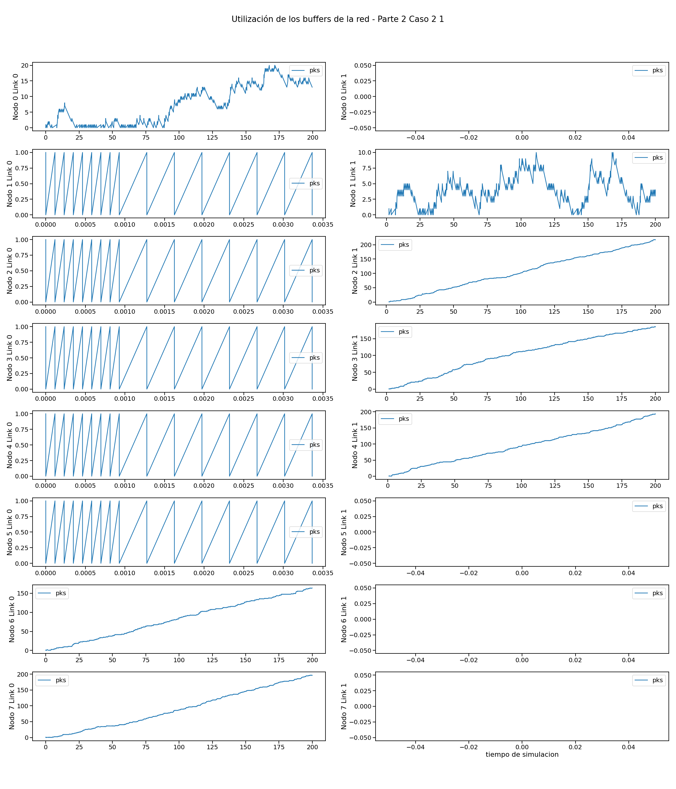

# Informe

## Presentación

### Objetivos del proyecto

● Leer, comprender y generar modelos de red en Omnet++.
● Analizar tráfico de red bajo diferentes estrategias de enrutamiento.
● Diseñar y proponer soluciones de enrutamiento bajo diferentes topologías.

### Resumen del trabajo

En este trabajo analizaremos el rol de la capa de red, que deberá decidir por qué interface enviar los paquetes que le llegan ya sea desde la capa de aplicación superior o desde las capas de enlaces inferiores.
Nos enfrentaremos a el problema de enrutar el tráfico que confluye desde los módulos por múltiples entradas y salidas, utilizando un algoritmo simple (dado por la cátedra) y otro mas complejo con el fin de comparar sus diferentes efectos.
Para ello tomaremos estadísticas y probaremos diferentes casos con ambos algoritmos de enrutamiento para ver su influencia utilizando la herramienta de simulación de eventos discretos Omnet++, bajo el lenguaje c++.

## Estructura del informe

Hemos tomado los siguientes datos para estudiar el efecto de los diferentes algoritmos de enrutamiento en los casos propuestos:

- Utilización de los buffers de la red (Buffer Size)
- Entrega de paquetes a la app del node 5 por origen (Delay y Source)
- Paquetes llegados a node 5 app por origen (Source)
- Cantidad de saltos utilizados por cada paquete por origen (hopCount y Source)

<!-- Explicar como se estructurara el informe brevemente -->
<!-- Presentar brevemente la estructura del informe. Dar algunos detalles mas del proyecto.
Introducir que vamos a dividir el informe en dos partes y que luego las compararemos.
-->

---

## Introducción

<!--
Describir el estado del arte. (trabajos previos) ..."
-->
<!--
- Metodología de trabajo.
-->

### Generalidades y definiciones

<!-- Agregar definiciones generales, teoría para ya dar por sentada en ambas partes. -->

#### Topología de red y Estructura interna de los nodos

La red consta de 8 nodos conectados en forma de anillo, cada uno con dos interfaces de comunicación full-duplex con dos posibles vecinos.

Internamente, cada nodo cuenta con dos capas de enlace (link o lnk, una con cada vecino), una capa de red (net) y una capa de aplicación (app). La capa de aplicación y la capa de enlace implementan generadores de tráfico y buffers respectivamente.

{width=500 height=auto}

<!-- TODO: Explicar interArrivalTime y packetByteSize -->

#### Problemáticas

<!--
- Definir el problema y contextualizar al lector con definiciones básicas.
  + "Nosotros en las redes vamos a encontrar tal y tal problema ..."
-->

#### Casos de estudio

- _Caso 1:_ Nodos (0,2) generan tráfico hacia el node[5] con packetByteSize e interArrivalTime idénticos entre ambos nodos.
- _Caso 2:_ Nodos (0,1,2,3,4,6,7) generan tráfico hacia el node[5] con packetByteSize e interArrivalTime idénticos entre todos los nodos.
<!--
- Presentación de nuestros casos de estudio.
  - Explicar caso 1: su ventaja, problemas, que esperamos ver, etc.
  - Explicar caso 2: su ventaja, problemas, que esperamos ver, etc.
    -->

#### Tipos de nodos en un flujo de datos

- _No utilizados:_ No reciben paquetes de su app ni de ningún vecino.
- _Generador:_ Recibe paquetes de su app y los transmite.
- _Conector:_ Recibe y retransmite paquetes de algún vecino.
- _Consumidor:_ Recibe y consume (manda a su app) paquetes de algún vecino.

---

## Parte 1

### Métodos

#### Algoritmo de enrutamiento

<!--
- Describimos el algoritmo.
-->

Cada paquete que recibe un nodo enrutador es evaluado para determinar si el nodo local es el destino final del mismo. En caso de que lo sea, el paquete es enviado a la capa de aplicación local. En caso de que el paquete esté destinado a otro nodo, la capa de red se encarga de re-transmitirlo por la interface número 0 (toLn [0]) que es la que envía el tráfico en sentido de las manecillas del reloj a lo largo del anillo hasta llegar al destino.

<!--
#### Hipótesis
QUESTION: va una hip en esta parte?
- Una pequeña hipótesis de porque creemos que va a funcionar.
-->

### Resultados

<!-- Gráficos y análisis de los mismos
estudiar las métricas tomadas. ¿Qué métricas se obtienen? ¿Cómo es el uso de los recursos de la red? ¿Se puede mejorar?
En el caso 2 explore y determine a partir de qué valor de interArrivalTime se puede garantizar un equilibrio o estabilidad en la red. Justifique.
-->

#### Caso 1

> _Recordemos:_ En este caso, los nodos (0,2) generan tráfico hacia el node[5] con packetByteSize e interArrivalTime idénticos entre ambos.

Nuestro algoritmo siempre enruta los paquetes por la salida en dirección de las manecillas del reloj, osea por node[i].lnk[0].
Por lo tanto el flujo de paquetes seguirá estos caminos:

> **Flujo de transmisión de paquetes**
> Node[2].lnk[0] (gen) --> Node[1].lnk[0] --> Node[0].lnk[0] (gen) --> Node[7].lnk[0] --> Node[6].lnk[0] --> Node[5] (sink)

Sabiendo esto podemos categorizar a los nodos de la siguiente forma:

- _Nodos Generadores:_ {2,0}
- _Nodos Consumidores:_ {5}
- _Nodos Conectores:_ {1,0,7,6}
- _Nodos No utilizados:_ {3,4}

_Como afecta al buffer de cada nodo esta distribución?_

{width=850 height=auto}

Como deducimos anteriormente, los nodos no utilizan .lnk[1] debido a nuestro algoritmo, por lo que habremos como si no existiecen hasta la parte 2.
En el grafico podemos notar lo siguiente:

- Los nodos _No utilizados_ {3,4} y el _Consumidor_ {5} no utilizan su buffer.
  Esto se puede explicar debido a que ninguno transmite ni re-transmite paquetes.
  Es trivial en el cso de los nodos {3,4} ya que tampoco les llegan de ninguna forma, pero al nodo[5] si le llegan.
  Lo que sucede allí es que la transmisión a la app es directa por lo que no hay retardo que requiera la utilización del buffer del node[5].

- Los nodos _Conectores_ no _Generadores_ {1,7,6} almacenan en su buffer entre 1 y 0 paquetes.
  Esto se explica debido a que hay un tiempo de transmisión de los paquetes, por lo que se requiere guardarlos en un buffer. Pero la velocidad de transmisión de los paquetes no es menor a la velocidad con la que llegan, por lo tanto no crece la utilización de sus buffers con el tiempo manteniéndose en un rango constante entre 1 y 0.

- El nodo _Generador_ no _Conector_ node[2] tiene una mayor y variante utilización de su buffer.
  Que utilice mas su buffer es debido a que recibe paquetes a una velocidad mayor de la que los puede transmitir.
  La variabilidad de la utilización de su buffer se explica a su vez porque los paquetes los recibe desde su app, la cual no le envía paquetes de forma constante.

- Por ultimo, el nodo _Generador_ y _Conector_ node[0] es el que mas utilización tiene de su buffer.
  Esto es causado por dos factores. El primero es que recibe paquetes de forma contante al igual que los demás nodos _Conectores_ por lo que no tiene "descanso" digamos. Luego, también recibe paquetes de su app al ser también un nodo _Generador_ lo que causa que a momentos se le envié una mayor cantidad de paquetes.
  Ambos factores causan que la velocidad con la que le llegan paquetes sea constantemente mayor a la velocidad con la que los puede enviar. Por esta razón podemos ver una utilización constantemente al alza de su buffer; con ciertas micro variaciones que vendrían a ser, como en el caso del node[2], gracias al envió variable de su app.

El principal objetivo de toda red es que los paquetes lleguen desde su origen a su destino, por lo tanto, veamos mas profundamente la llegada de paquetes de los _Generadores_ {2,0} al _Consumidor_ node[5].

_Cuantos paquetes de cada generador llegan al destino node[5]?_

{width=500 height=auto}

Podemos notar que llegan paquetes de ambos nodos _Generadores_ pero con una diferencia, llegan mas del node[0].

Esto se debe al hecho de estar el node[0] mas cerca del destino y en el camino entre el nodo 2 y 5. Esto hace que primero lleguen los paquetes del node[0] en promedio ya que los del node[2] no solo se empiezan a enviar de mas lejos, sino que deben competir el espacio del buffer en el node[0] con los paquetes que se generan ahi mismo.

_En el siguiente gráfico podemos ver el delay con el que llegan los paquetes al node[5]._

{width=850 height=auto}

En este gráfico podemos notar:

- _Llegan mas paquetes del node[0]_: Esto coincide con lo dicho antes del gráfico.
- _El delay va aumentando_: Esto esta directamente relacionado por el aumento lineal del buffer del node[0] ya que al haber cada vez mas paquetes en cola, cada vez tardaran mas tiempo en llegar.
- _El delay del node[2] es generalmente mayor al del node[0]_: Esto se debe a que los paquetes enviados desde el node[2] vienen de mas lejos que los del node[0], por lo que tardan mas tiempo.

_En el siguiente gráfico podemos ver una representación visual de las distancias recorridas por los paquetes desde su origen a su destino._

{width=850 height=auto}

En este gráfico podemos observar como la distancia en saltos recorrida por los paquetes de node[2] es mayor a los del node[0].
Como hemos dicho anteriormente, el node[0] esta mas cerca y de ahi la menor distancia.
Por lo que podemos concluir que el aumento de la distancia que recorren los paquetes es:

- Proporcional al aumento del delay con el que llegan a destino. Cuanto mas recorren, mas delay tendrán en llegar.
- Inversamente proporcional al aumento de la cantidad de paquetes que llegan a destino.

#### Caso 2

> _Recordemos:_ En este caso, los nodos (0,1,2,3,4,6,7) generan tráfico hacia el node[5] con packetByteSize e interArrivalTime idénticos entre todos los nodos.

Nuestro algoritmo siempre enruta los paquetes por la salida en dirección de las manecillas del reloj.
Por lo tanto el flujo de paquetes seguirá estos caminos:

> **Flujo de transmisión de paquetes**
> Node[4].lnk[0] (gen) --> Node[3].lnk[0] (gen) --> Node[2].lnk[0] (gen) --> Node[1].lnk[0] (gen) --> Node[0].lnk[0] (gen) --> Node[7].lnk[0] (gen) --> Node[6].lnk[0] (gen) --> Node[5] (sink)

Sabiendo esto podemos categorizar a los nodos de la siguiente forma:

- _Nodos Generadores:_ {0,1,2,3,4,6,7}
- _Nodos Consumidores:_ {5}
- _Nodos Conectores:_ {0,1,2,3,6,7}
- _Nodos No utilizados:_ {}

_Como afecta al buffer de cada nodo esta distribución?_

{width=850 height=auto}

Ahora podemos notar lo siguiente:

- Los nodos _Conectores_ y _Generadores_ {0,1,2,3,6,7} tienen un comportamiento equivalente al que analizamos en el caso 1 en el node[0].
- El nodo _Generador_ no _Conector_ node[4] a su vez también tiene un comportamiento equivalente al que analizamos en el caso 1 en el node[2].
- Por ultimo, no observamos ningún cambio en el _Consumidor_ node[5], lo que es compatible con lo analizado en el caso 1.

_Cuantos paquetes de cada generador llegan al destino node[5]?_

{width=600 height=auto}

Podemos notar que llegan paquetes de todos los nodos _Generadores_ pero con una diferencia, llegan mas de los nodos mas cercanos en el flujo de transmisión de los paquetes.

Primero llegan los paquetes de los generadores mas cercanos en promedio ya que los demás no solo se empiezan a enviar de mas lejos, sino que deben competir por el espacio del buffer en los nodos _Conectores_ intermedios contra los paquetes que se generan ahi mismo.

Por lo tanto, los paquetes que vienen de mas lejos se irán quedando rezagados por cada nodo generador por el que pasen. Por esta razón es que podemos ver como casi no llegan paquetes de los últimos generadores.

Luego, podemos notar que a diferencia del caso 1, la diferencia entre los datos es mayor, casi como si se redujera a la mitad. Esto es debido a que cuando llegan paquetes a un generador de otro nodo, este debe no solo enviar sus paquetes, también el de los demás.

_En el siguiente gráfico podemos ver el delay con el que llegan los paquetes al node[5]._

{width=850 height=auto}

En este gráfico podemos notar:

- _Llegan mas paquetes de los nodos mas cercanos_: Esto coincide con lo dicho antes del gráfico.
- _El delay va aumentando_: Esto esta directamente relacionado por el aumento lineal del buffer de los nodos _Generadores_ y _Conectores_ {0,1,2,3,6,7} ya que al haber cada vez mas paquetes en cola, cada vez tardaran mas tiempo en llegar.
- _El delay de los nodos mas lejanos es generalmente mayor al de los mas cercanos_: Esto se debe a que los paquetes enviados desde mas lejos están a una mayor distancia y deben pasar por mas colas por lo que tardan mas tiempo.

_En el siguiente gráfico podemos ver una representación visual de las distancias recorridas por los paquetes desde su origen a su destino._

{width=850 height=auto}

En este gráfico podemos observar como la distancia en saltos recorrida por los paquetes de los paquetes de los nodos mas alejados e el flujo es mayor a los mas cercanos.
Por lo que podemos concluir que el aumento de la distancia que recorren los paquetes es:

- Proporcional al aumento del delay con el que llegan a destino. Cuanto mas recorren, mas delay tendrán en llegar. (recordar que también vimos que influye la situación en los buffers de los nodos _Conectores_ por los que pasa)
- Inversamente proporcional al aumento de la cantidad de paquetes que llegan a destino. (nuevamente, vimos que ademas influye que se vayan rezagando los paquetes)

---

## Parte 2

### Métodos

#### Algoritmo de enrutamiento

<!--
- Describimos el algoritmo.
-->

#### Como llegamos a esa idea

<!-- Como llegamos a esa idea. -->

#### Hipótesis de porque creemos que va a funcionar

<!--
- Una pequeña hipótesis de porque creemos que va a funcionar.
-->

### Resultados
<!-- Gráficos y análisis de los mismos
estudiar las métricas tomadas. ¿Qué métricas se obtienen? ¿Cómo es el uso de los recursos de la red? ¿Se puede mejorar?
¿Hay loops de enrutamiento? Más allá de lo que llegó
a implementar en el simulador, ¿Ve alguna manera de mejorar más aún su diseño?
En el caso 2 explore y determine a partir de qué valor de interArrivalTime se puede garantizar un equilibrio o estabilidad en la red. Justifique.
-->

#### Caso 1

{width=850 height=auto}
{width=600 height=auto}
{width=850 height=auto}
<!-- ![Buffer node[0].lnk[0] P2C1](./IMGs/Buffer_node0-lnk0_P2C1.png){width=850 height=auto}
![Buffer node[2].lnk[1] P2C1](./IMGs/Buffer_node2-lnk1_P2C1.png){width=850 height=auto} -->
{width=850 height=auto}

#### Caso 2

{width=850 height=auto}
{width=600 height=auto}
{width=850 height=auto}
{width=850 height=auto}

---

## Conclusiones

### Comparación de resultados

<!-- Comparar gráficos de ambas partes. solo poner los gráficos si hay algo que comparar o recordar.
Evalúe y compare su estrategia con los casos 1 y 2 de la tarea de análisis . ¿Cuánto4
mejoran las métricas? ¿Por qué?
-->

### Discusiones

<!-- cualquier cosa que no entre en la comparación de resultados va aca, ej: posibles mejoras, obs,conclusiones, ... -->

---

## Referencias

<!--
- Todas las referencias que usamos en el trabajo. LIBROS, PAPERS, WEB, ETC.
(Nosotros usamos el manual de Omnet++ y quizás algo más ...).
Si agregamos imágenes de Tanembaun para explicar algo, también se debe referenciar.
-->

- Andrew S. Tanenbaum, David J. Wetherall, Redes de Computadoras (5ta edición 2011), Pearson.
- Omnet++ Simulation Manual, (OMNeT++ version 6.0.3, 2020).
